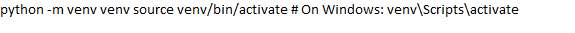
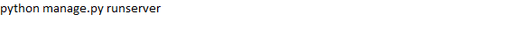

# Task Manager - Django Project

A simple Todo tasks manager built with Django.

## Features
- User registration and login
- Add, edit, delete tasks
- Bootstrap integration for a clean UI

## Installation
1. Clone the repository:

2. Navigate to the project folder:

3. Create and activate a virtual environment:

4. Install dependencies:

5. Run the server:

## License
This project is open-source under the MIT License.
